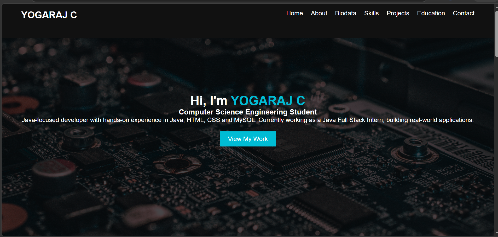
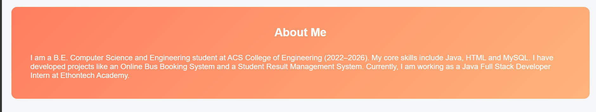
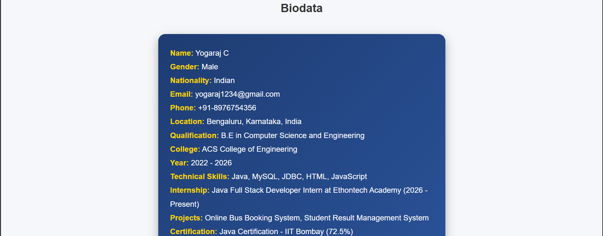
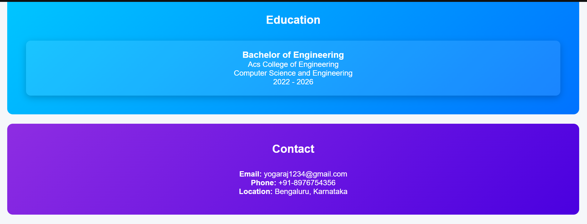
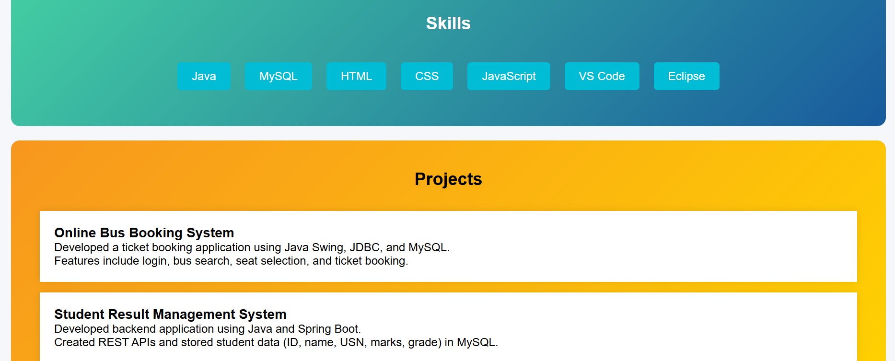

#  Personal Portfolio Website

A personal portfolio website to showcase my skills, projects, and contact information. Built using HTML, CSS, and JavaScript with a clean and responsive design.

---

##  Live Demo
 https://yogarajc77.github.io/personal-portfolio-website/

---

##  Screenshots

###  Home Section

###  About Section

###  Biodata Section

###  Education & Contact

###  Skills & Projects

---

##  Tech Stack

- HTML 
- CSS 
- JavaScript (JS)  

---

##  Project Structure

Protfolio

- index.html
- script.js
- style.css

screenshots

  - ./home.png
  - about.png
  - biodata.png
  - skils-projects.png
  - education-contact.png

    README.md

---

## How to Run Locally

1. clone the repository:

- git clone
  https://github.com/yogarajc77/personal-portofolio-website.git

2. Open to Folder:

- cd personal-protfolio-website

3. Run the project:
- Open `index.html` in your browser

---

##  Future Improvements

- Add animations and transitions   
- Improve UI/UX design   
- Add backend contact form  

---

##  Author

**Yogaraj C**  
 yogarajc77@gmail.com  
 https://github.com/yogarajc77  

---

## * Support

If you like this project, give it a * on GitHub!
